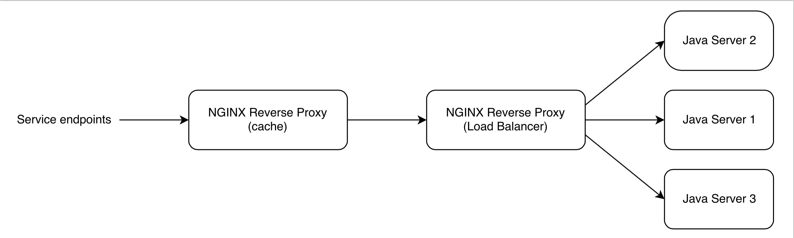

# Shopping REST-style

This repo provides a sample infrastructure for a backend REST architecture deployed for a shopping application.  
Below, a representation of the implemented architecture.

It provides a practical basis to study a REST architecture and mechanisms involved.  
All the components are launched locally via Docker.  
Details to launch and stop the infrastructure are provided below.  

## What do you need ?
JDK 8, Docker, Gradle

## Build Java application and start/restart infrastructure
###Instructions for first execution
Following scripts **must have execution rights** : `./launch-shop-infrastructure.sh`,  `./stop-delete-shop-infrastructure.sh`.  
Run `gradle install launchInfra`. It builds the project. Then it stops and removes Docker containers and images before rebuilding and launching each component.

## Start/restart infrastructure
Following scripts **must have execution rights** : `./launch-shop-infrastructure.sh`,  `./stop-delete-shop-infrastructure.sh`.  
Run `gradle launchInfra`. It stops and removes Docker containers and images before rebuilding and launching each component.

## Stop the infrastructure
Following script **must have execution rights** :  `./stop-delete-shop-infrastructure.sh`.  
Run `gradle stopAndDeleteInfra`. It stops and removes Docker containers.

## Check if everything is deployed
Run `docker ps`. You should get something like :  
```
CONTAINER ID        IMAGE                           COMMAND                CREATED             STATUS              PORTS                                           NAMES
166b07d5cb33        api-shop-front:latest           "nginx -g 'daemon of   About an hour ago   Up About an hour    0.0.0.0:49224->443/tcp, 0.0.0.0:49225->80/tcp   api-shop-front
5802cb232e5a        api-shop-load-balancer:latest   "nginx -g 'daemon of   About an hour ago   Up About an hour    0.0.0.0:49222->443/tcp, 0.0.0.0:49223->80/tcp   api-shop-load-balancer
3e098cada83a        api-shop-server:latest          "bash /usr/local/bin   About an hour ago   Up About an hour    0.0.0.0:49221->8080/tcp                         api-shop-server-3
06c24ede08a8        api-shop-server:latest          "bash /usr/local/bin   About an hour ago   Up About an hour    0.0.0.0:49220->8080/tcp                         api-shop-server-2
b7e4ca71ac2a        api-shop-server:latest          "bash /usr/local/bin   About an hour ago   Up About an hour    0.0.0.0:49219->8080/tcp                         api-shop-server-1
```
**Ports for container api-shop-front** are what we are looking for. Just take the port corresponding to api-shop-front -> 80/tcp (in the example above 49225).  
On Linux, you can check everything is fine by making HTTP GET request on `http://localhost:PORT_FOR_80/health`.  
On MacOS, get boot2docker IP first `boot2docker ip`. Then you can check everything is fine by making HTTP GET request on `http://BOOT_2_DOCKER_IP:PORT_FOR_80/health`.  
You will get a 200 and **Up and running!** if everything is fine.
