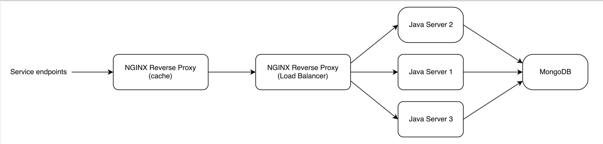

# Shopping REST-style

This repo provides a minimalistic infrastructure for a backend REST architecture deployed for an imaginary shopping application.
The figure below shows the simple architecture diagram which is implemented.

This is a demo providing practical basis for a theoretical approach to REST architectures.  
All the components are launched locally via Docker.  
Details to launch and stop the infrastructure are provided below.  

## What do you need to launch it ?
JDK 8, Docker, Gradle

## Build Java application and start/restart infrastructure
**This is what you must do this when running it for the first time**  
`./launch-shop-infrastructure.sh` and `./stop-delete-shop-infrastructure.sh` must have execution right.  
Then just run `gradle install launchInfra`

## Start/restart infrastructure
`./launch-shop-infrastructure.sh` and `./stop-delete-shop-infrastructure.sh` must have execution right.  
Then just run `gradle launchInfra`

## Stop the infrastructure
`./stop-delete-shop-infrastructure.sh` must have execution right.  
Then run `gradle stopAndDeleteInfra`

## Check if everything is deployed
Run `docker ps`. You should get something like :  
```
CONTAINER ID        IMAGE                           COMMAND                CREATED             STATUS              PORTS                                           NAMES
166b07d5cb33        api-shop-front:latest           "nginx -g 'daemon of   About an hour ago   Up About an hour    0.0.0.0:49224->443/tcp, 0.0.0.0:49225->80/tcp   api-shop-front
5802cb232e5a        api-shop-load-balancer:latest   "nginx -g 'daemon of   About an hour ago   Up About an hour    0.0.0.0:49222->443/tcp, 0.0.0.0:49223->80/tcp   api-shop-load-balancer
3e098cada83a        api-shop-server:latest          "bash /usr/local/bin   About an hour ago   Up About an hour    0.0.0.0:49221->8080/tcp                         api-shop-server-3
06c24ede08a8        api-shop-server:latest          "bash /usr/local/bin   About an hour ago   Up About an hour    0.0.0.0:49220->8080/tcp                         api-shop-server-2
b7e4ca71ac2a        api-shop-server:latest          "bash /usr/local/bin   About an hour ago   Up About an hour    0.0.0.0:49219->8080/tcp                         api-shop-server-1
```
**Ports for container api-shop-front** are what we are looking for. Just take the port corresponding to 80/tcp (in our example 49225).  
On Linux, you can check everything is fine by making HTTP GET request on `http://localhost:PORT_FOR_80/health`.  
On MacOS, get boot2docker IP first `boot2docker ip`. Then you can check everything is fine by making HTTP GET request on `http://BOOT_2_DOCKER_IP:PORT_FOR_80/health`.  
You should get **Up and running!** if everything is deployed.
